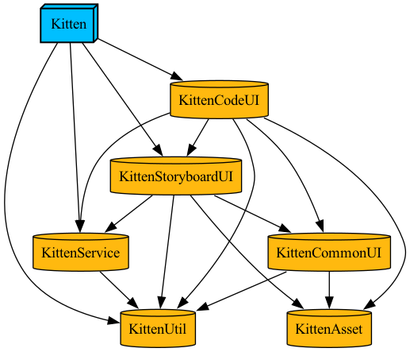

## Tuist 시작 방법
1. [tuist 설치](https://docs.tuist.io/documentation/tuist/installation/)
2.  터미널에 `tuist fetch` 입력
1. 터미널에 `tuist generate` 입력
3. 생성된 `Kitten.xcworkspace`로 xcode 열기
4. [Tuist > Dependencies > SwiftPakageManager > .build > checkouts ] 폴더 찾기

이중 Moya, KakaoSDKUser, KakaoSDKAuth, KakaoSDKCommon 에 대해 Minimum Deployments를 **11.0 > 12.0** 으로 변경

5. 빌드

## 브랜치
- main: 배포 가능 버전 (현: Tuist 적용 전)
- dev: 개발 버전 (현: Tuist 적용 후)

## Tuist 의존성

- **Kitten**: App 타겟
- **KittenCommonUI**: Storyboard와 Code에 공통적으로 쓰이는 뷰 및 Extension을 포함한 모듈
- **KittenCodeUI**: 코드베이스로 작성된 뷰 모듈
- **KittenStoryboardUI**: 스토리보드로 작성된 뷰 모듈
- **KittenAsset**: Asset 파일 및 stencil로 제너레이트된 파일 모듈
- **KittenService**: 네트워킹 모듈
- **KittenUtil**: 그 외 모듈에 전역적으로 사용될 수 있는 기능들 모음
